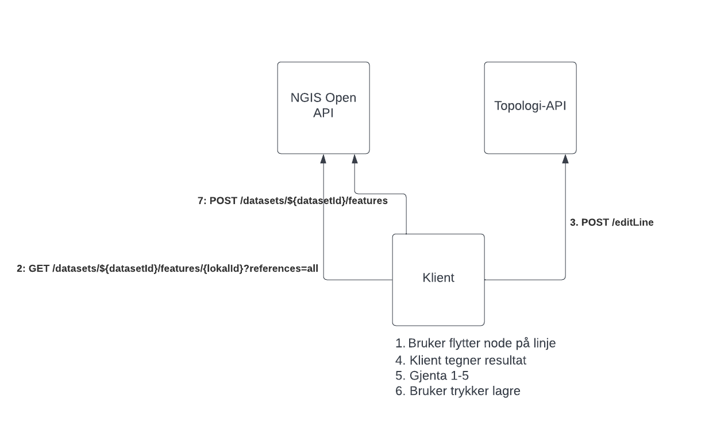
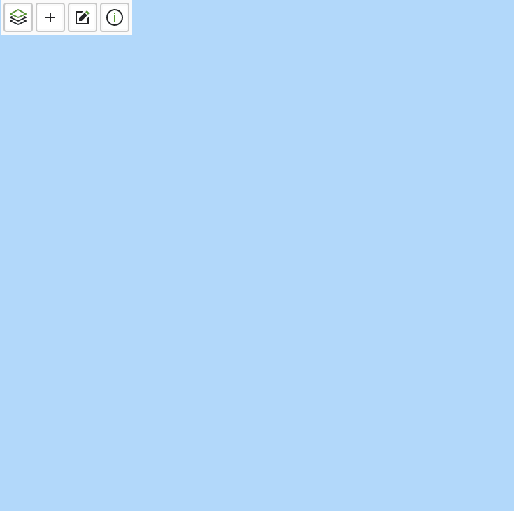
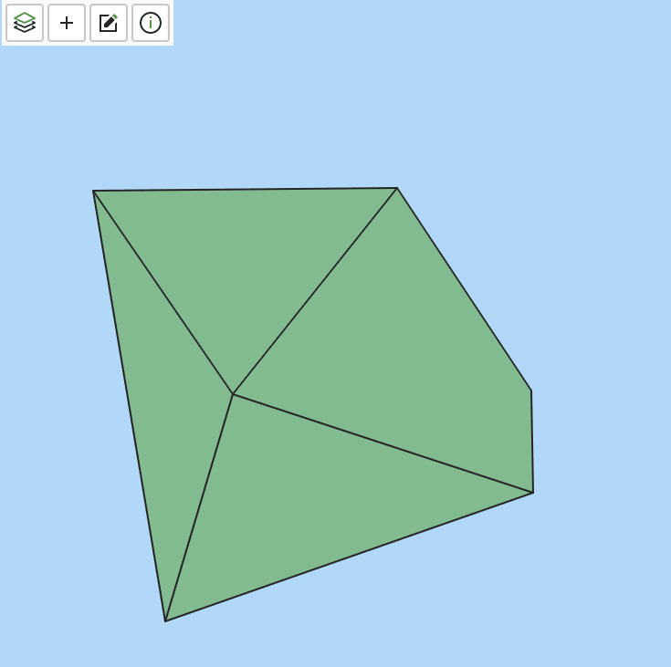
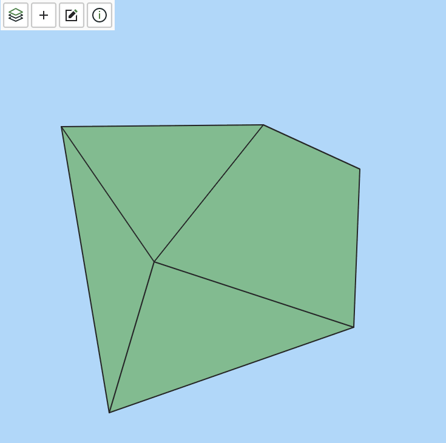
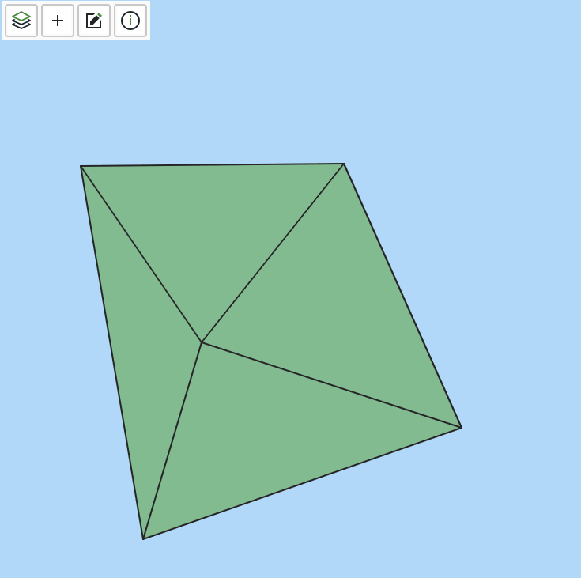
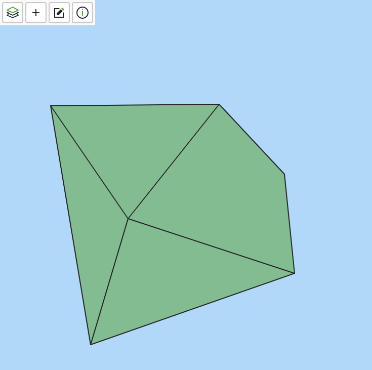
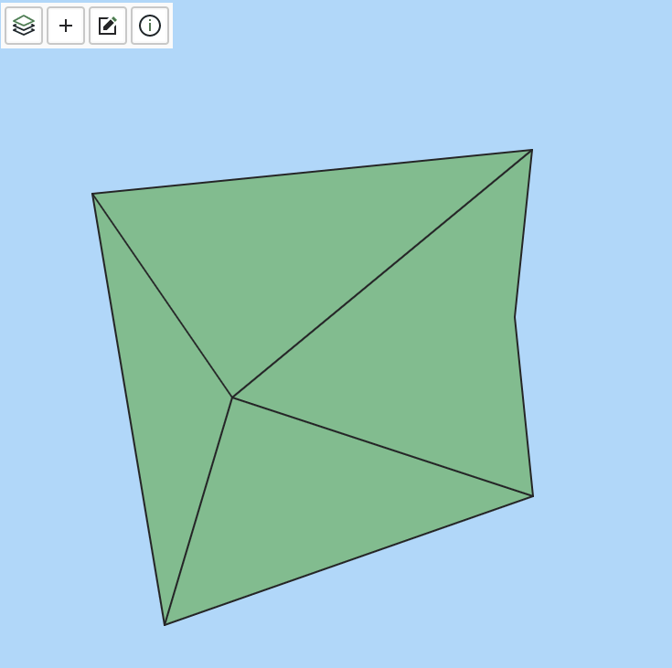

# NGIS-OpenAPI-felleskomponent-delt-geometri
Felles hjelpe-komponent for redigering av flategeometri gjennom NGIS-OpenAPI.

## Bruk av APIet
Dette APIet er et stateless api som skal hjelpe "enkle" (web)-klienter å håndtere topologi-kravene som stilles av NGIS-OpenAPI. Spesielt med tanke på å håndtere delte grenselinjer. 

Apiet bruker de samme datamodellene som NGIS-OpenAPI, og har tre endepunkter:

### /createGeometry
Metode for å lage objekt(er) som kan lagres mot NgisOpenApi gitt en geometri

#### Input: 
- NgisFeature Feature: Objekt som skal opprettes.
- List<NgisFeature> AffectedFeatures: Liste over features som er relatert

#### Output: 
- List<NgisFeature> AffectedFeatures: Features som må sendes til NgisOpenApi
- bool IsValid: Klarte APIet å danne et gyldig objekt?
#### Eksempel

For å opprette en flate, gitt at brukeren har tegnet en flate, følges denne arbeidsflyten:

1. Brukeren tegner et polygon i klient
2. Klienten lager en GeoJSON feature av polygonet
3. Klienten sender featuren til /createGeometry
4. APIet returnerer to objekter: en linje og en flate med referanser
5. Brukeren legger til egenskaper på linje og flate
6. Klienten lagrer objektene via NgisOpenApi


### /polygonFromLines
Metode for å generere en flate-feature gitt en liste med LinjeFeatures

#### Input: 
- List<NgisFeature> Features: Linje-Features som skal inngå i flaten. Trenger ikke å være orientert riktig eller sortert. Kan også inneholde flater som avgrenser eventuelle hull
- Point? Centroid: Optionalt punkt som må være innenfor flaten for at den skal være gyldig

#### Output: 
- List<NgisFeature> AffectedFeatures: Features som må sendes til NgisOpenApi. Denne inneholder den genererte flaten, samt linje-features som refereres.
- bool IsValid: Klarte APIet å danne en gyldig respons?

#### Eksempel

For å opprette en flate ved å angi linje, følges denne arbeidsflyten:

1. Brukeren tegner linje, eller bruker eksisterende
2. Brukeren velger et sett med linje som skal danne en flate
2.1 Brukeren kan også velge å definere et representrasjonspunkt for flaten
3. Linjene sendes til /polygonFromLines
4. APIet returnerer et objekt som indikerer om
4.1 Det kunne danne en flate
4.2 Hvis ja: En liste med objekter som representerer flaten og linjene den representerer
5. Brukeren legger til egenskaper på objekter
6. Klienten lagrer objektene via NgisOpenApi


### /editLine
Metode for å redigere linje-objekter.

#### Input: 
- NgisFeature Feature: Linje-feature som skal redigeres
- EditLineOperation Edit: Objekt med informasjon om endringen
- List<NgisFeature> AffectedFeatures: Linje-featurens referanser. Fåes ved å spørre NgisOpenApi på ```/datasets/${datasetId}/features/${lokalId}?references=all```

EditLineOperation har følgende struktur
```
{
  operation: "Edit" | "Insert" | "Delete" // om en node skal endres, insettes eller slettes
  nodeIndex: number // 0-basert index for noden som skal endres
  nodeValue: number[] // nye koordinater fornoden. Trenger ikke angies ved sletting
}
```

#### Output: 
- List<NgisFeature> AffectedFeatures: Features som må sendes til NgisOpenApi. Denne alle affectedFeatures som er endret, samt endret feature.
- bool IsValid: Klarte APIet å danne en gyldig respons?

#### Eksempel

Å redigere en linje kan medføre endringer på en rekke objekter. Anbefalt arbeidsflyt i en klient er som følger

1. Brukeren aktiverer redigeringsmodus
2. Brukeren velger en linje
3. Brukeren sletter, endrer eller oppretter en node
4. Klienten kaller NgisOpenApi og henter referanser
5. Klienten kaller /editLine
5.1 Hvis isValid: Klienten tegner alle affectedFeatures på nytt
5.2 Hvis ikke isValid: Klienten reverserer endring
6. Brukeren gjentar steg 2-5 til ønsket state er oppnådd
7. Klienten mellomlagrer endringer for å kunne vise på skjerm samt kunne lagre
8. Brukeren klikker lagre
9. Klienten lagrer objektene via NgisOpenApi



#### Systemskisse

## Kode-layout

### DeltGeometriFelleskomponent.Api
Aspnet core 6 api-implementasjon av api

Bruker: 

- NSwag for swagger-generering
- NettopologySuite for geometrioperasjoner
- NetTopologySuite.IO.GeoJSON for å håndtere geojson input/output

### DeltGeometriFelleskomponent.TopologyImplementation
Implementasjon av topologi-håndtering

### DeltGeometriFelleskomponent.Models
Klasser brukt av Api og TopologyImplementation

### DeltGeometriFelleskomponent.Tests
Tester (xUnit)


## Eksempler
### Opprette flate ved å tegne et polygon
De fleste enkle klienter har funksjonalitet for å tegne polygoner. 

For å representere et polygon med delt geometri trenger vi å opprette en linje-avgrensning. Dette kan gjøres med ```createGeometry```-endepunktet.


1. Brukeren tegner et polygon
2. Klienten sender polygonet til ```createGeometry```
3. ```createGeometry``` returnerer en flate og en linje
4. Klienten viser opprettede geometrier
5. Brukeren fyller ut egenskaper for flate og linje
6. Klienten sender flate og linje til NgisOpenApi for lagring


### Opprette flate ved å velge linjer
For å lage mer avanserte flater med referanser til mer enn en grenselinje må man lage et flate-objekt med referanser til linjene.

Felleskomponentens metode ```polygonFromLines``` har funksjonalitet for å bistå med dette. 



1. Brukeren tegner en rekke linjer (OBS: her må snap-funksjonalitet brukes slik at de er koblet sammen)
2. Klienten sender linjene til NgisOpenApi for lagring
3. Brukeren velger linjene som skal danne en flate
4. Klienten sender linjene til ```polygonFromLines```
5. Klienten kan vise opprettet flate 
5. Brukeren fyller ut egenskaper for flate 
6. Klienten sender flate til NgisOpenApi for lagring

### Flytte punkt på en linje
Når et punkt på en linje flyttes kan en eller to flater påvirkes. ```editLine``` har funksjonalitet for å hjelpe med dette


1. Brukeren velger linje som skal redigeres
2. Brukeren flytter et punkt
3. Klienten sender feature, avhengigheter samt endring til ```editLine```
4. Redigerte objekter kan vises
5. Redigerte objekter kan sendes til NgisOpenApi for lagring

### Slette punkt på en linje
Samme operasjon som for å flytte punkt



### Sette inn punkt på en linje
Samme operasjon som for å flytte punkt



### Redigere nodepunkt på linje
Et nodepunkt er et (ende)punkt på en linje der flere linjer kan møtes. Når et slikt punkt redigeres kan n antall flater og n antall linjer påvirkes. ```editLine``` skal håndtere dette.






## Geometri-eksempler

Fila ```DeltGeometriFelleskomponent.Tests\Examples\example_geometries.geojson``` inneholder en rekke eksempelgeometrier, som kan kombineres på følgende måter

- Flate laget fra en linje ccw: 9
- Flate laget fra en linje cw: 8
- Flate laget fra to linjer ccw: 2,7
- Flate laget fra to linjer cw: 5, 6
- Flate laget fra to linjer, ccw og cw: 1,2
- Flate med ett hull: 1, 2, 3, 4
- Flate med to hull: 1, 2, 3, 4, 9
- Flate med tre hull: 1, 2, 3, 4, 8, 9


