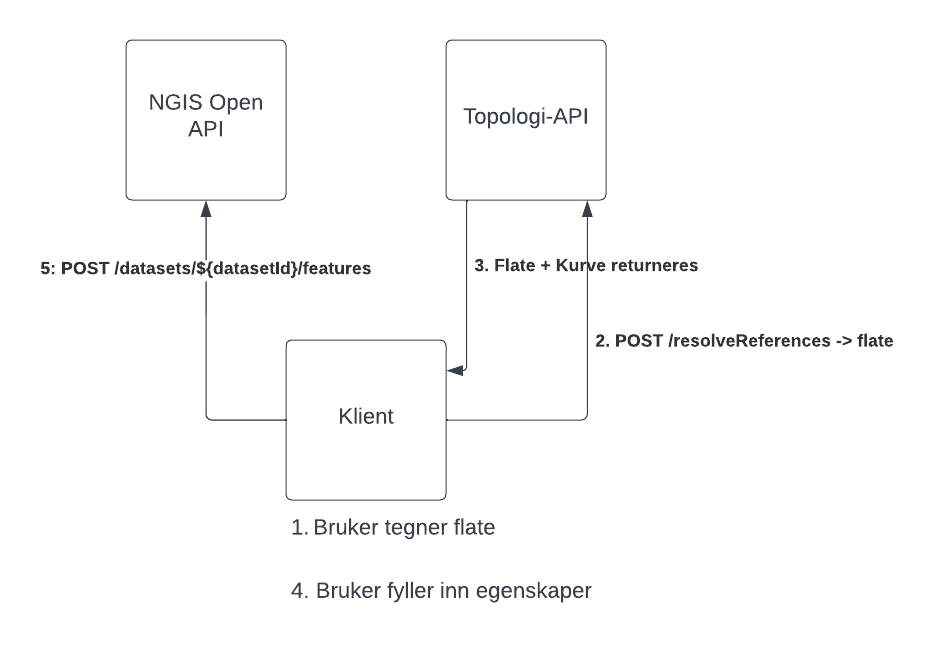
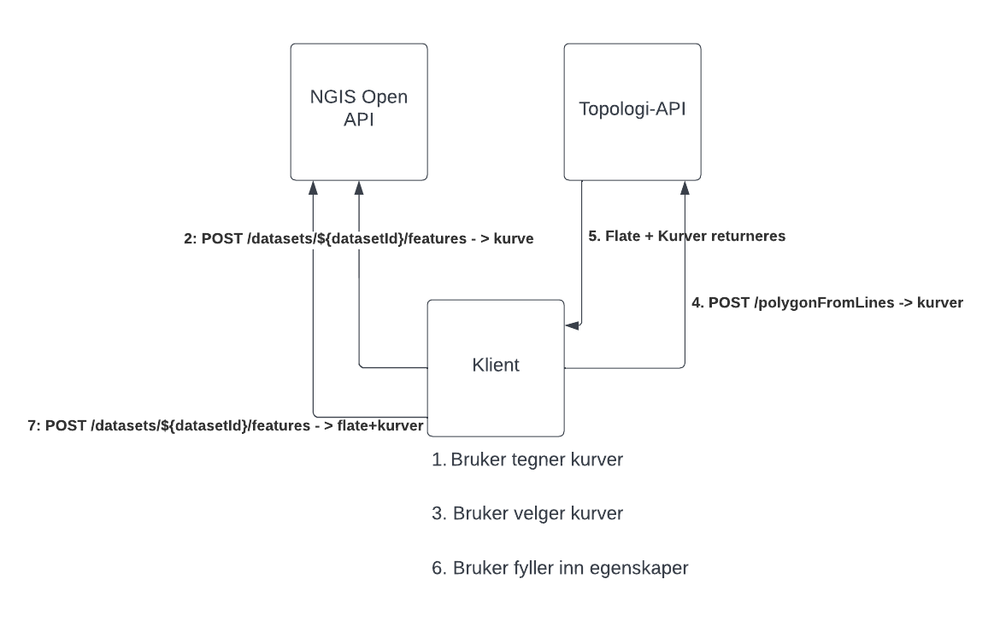

# NGIS-OpenAPI-felleskomponent-delt-geometri
Felles hjelpe-komponent for redigering av flategeometri gjennom NGIS-OpenAPI.

## Bruk av APIet
Dette APIet er et stateless api som skal hjelpe "enkle" (web)-klienter å håndtere topologi-kravene som stilles av NGIS-OpenAPI. Spesielt med tanke på å håndtere delte grenselinjer. 

Apiet bruker de samme datamodellene som NGIS-OpenAPI, og støtter pr nå to endepunkter:

### /resolveReferences
APIets hovedmetode, som tar seg av opprettelse, editering og sletting av objekter. 

#### Input: 
- NgisFeature Feature: Feature som skal opprettes/slettes/editeres
- List<NgisFeature> AffectedFeatures: Liste over features som er relatert

#### Output: 
- List<NgisFeature> AffectedFeatures: Features som må sendes til NgisOpenApi
- bool IsValid: Klarte APIet å danne en gyldig respons?

#### Eksempel


For å opprette en flate, gitt at brukeren har tegnet en flate, følges denne arbeidsflyten:


### /polygonFromLines
Hjelpemetode for å generere en flate-feature gitt en liste med LinjeFeatures

#### Input: 
- List<NgisFeature> Features: Linje-Features som skal inngå i flaten. Trenger ikke å være orientert riktig eller sortert. Kan også inneholde flater som avgrenser eventuelle hull
- Point? Centroid: Optionalt punkt som må være innenfor flaten for at den skal være gyldig

#### Output: 
- List<NgisFeature> AffectedFeatures: Features som må sendes til NgisOpenApi. Denne inneholder den genererte flaten, samt linje-features som refereres.
- bool IsValid: Klarte APIet å danne en gyldig respons?

#### Eksempel



#### Systemskisse

## Kode-layout

### DeltGeometriFelleskomponent.Api
Aspnet core 6 api-implementasjon av api

Bruker: 

- NSwag for swagger-generering
- NettopologySuite for geometrioperasjoner
- NetTopologySuite.IO.GeoJSON for å håndtere geojson input/output

### DeltGeometriFelleskomponent.TopologyImplementation
Implementasjon av topologi-håndtering

### DeltGeometriFelleskomponent.Models
Klasser brukt av Api og TopologyImplementation

### DeltGeometriFelleskomponent.Tests
Tester (xUnit)

### Geometri-eksempler

Fila ```DeltGeometriFelleskomponent.Tests\Examples\example_geometries.geojson``` inneholder en rekke eksempelgeometrier, som kan kombineres på følgende måter

- Flate laget fra en linje ccw: 9
- Flate laget fra en linje cw: 8
- Flate laget fra to linjer ccw: 2,7
- Flate laget fra to linjer cw: 5, 6
- Flate laget fra to linjer, ccw og cw: 1,2
- Flate med ett hull: 1, 2, 3, 4
- Flate med to hull: 1, 2, 3, 4, 9
- Flate med tre hull: 1, 2, 3, 4, 8, 9


