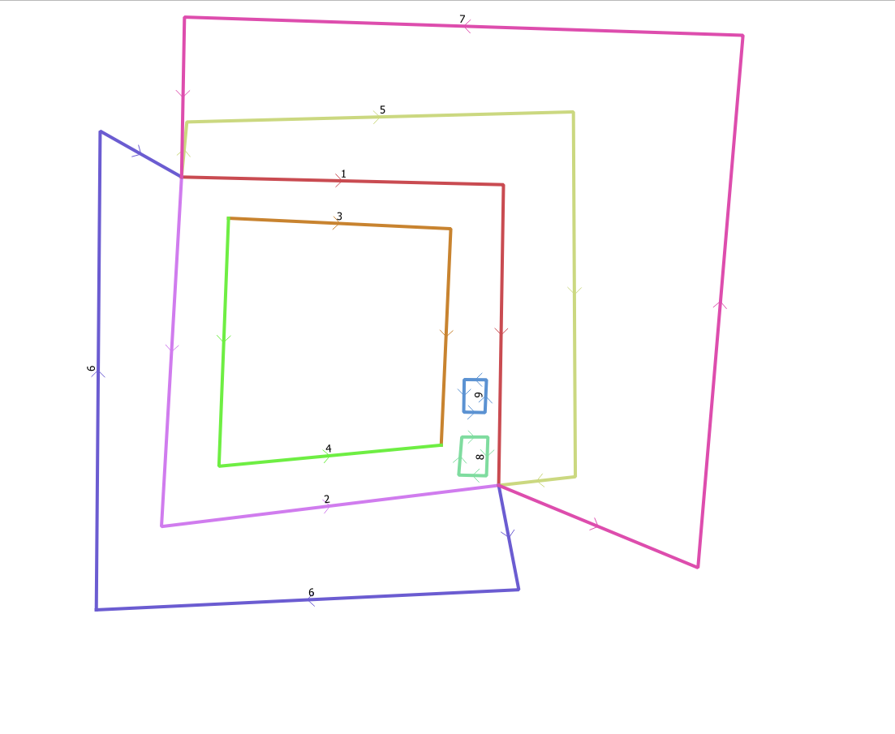

# NGIS-OpenAPI-felleskomponent-delt-geometri
Felles hjelpe-komponent for redigering av flategeometri gjennom NGIS-OpenAPI.


## Kode-layout

### DeltGeometriFelleskomponent.Api
Aspnet core 6 api-implementasjon av api

Bruker: 

- NSwag for swagger-generering
- NetTopologySuite.IO.GeoJSON4STJ for å håndtere geojson input/output

### DeltGeometriFelleskomponent.TopologyImplementation
Implementasjon av topologi-håndtering

### DeltGeometriFelleskomponent.Models
Klasser brukt av Api og TopologyImplementation

### DeltGeometriFelleskomponent.Tests
Tester (xUnit)

### Geometri-eksempler

Fila ```DeltGeometriFelleskomponent.Tests\Examples\example_geometries.geojson``` inneholder en rekke eksempelgeometrier, som kan kombineres på følgende måter

- Flate laget fra en linje ccw: 9
- Flate laget fra en linje cw: 8
- Flate laget fra to linjer ccw: 2,7
- Flate laget fra to linjer cw: 5, 6
- Flate laget fra to linjer, ccw og cw: 1,2
- Flate med ett hull: 1, 2, 3, 4
- Flate med to hull: 1, 2, 3, 4, 9
- Flate med tre hull: 1, 2, 3, 4, 8, 9


